# [](https://dark-castle-lite-2da09c77a17b.herokuapp.com)

[](https://github.com/Ash-5p/dark-castle-lite/commits/main)
[](https://github.com/Ash-5p/dark-castle-lite/commits/main)
[](https://github.com/Ash-5p/dark-castle-lite)

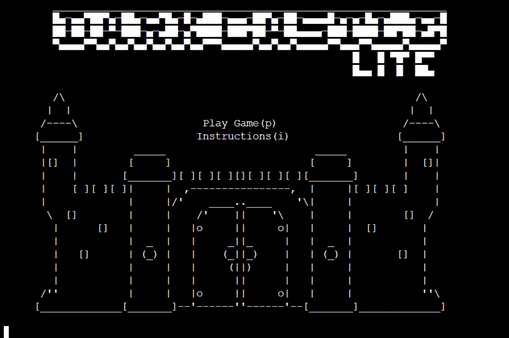

**Main Goal:**
- The inspiration for this game comes from a board game I love to play with my friends, published by Themeborne, called [Escape the Dark Castle](https://themeborne.com/products/escape-the-dark-castle). The main goal of this game is provide a fun, replayable story experience with combat elements in the style of a retro text adventure game, which captures the essence of the board game on which it is inspired. 

**Target Audience:**
- Fans of the Escape the Dark Castle board game.
- People who enjoy text adventure games.
- Retro gamers.
- People who enjoy horror stories, and stories which have different outcomes based on decisions.

## Features

### Existing Features

- **Homescreen**

    - The homescreen's purpose is to allow the user to start the game, or navigate to the instructions menu. The player is brought back to this screen upon successfully completing the game, or recieving a gameover.


- **Instructions Screen**

    - The instructions screen is made up of 5 pages, and serves to teach the player about the mechanics of the game, such as the combat system, nature match-ups and items.


- **Enter Name Screen**

    - This screen prompts the player to choose their character name. This can contain letters & numbers, and must be between 1 & 15 character long. This name will be displayed at different points throughout the game.

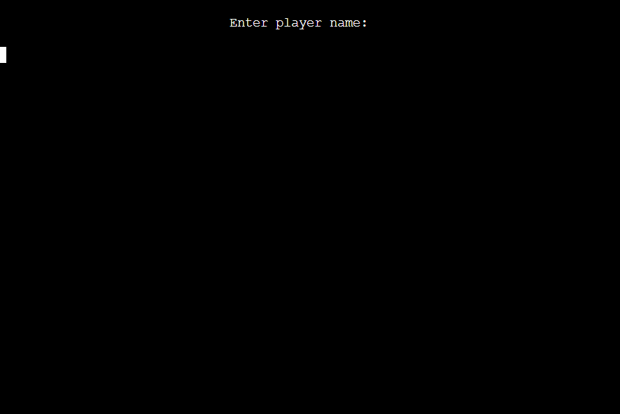

- **Choose Character Screen**

    - This screen prompts the player to choose their character from a selection of 3 choices (Fighter, Scholar, Thief). Each character has different might, wisdom & cunning stats which is displayed next to each character. These stats will effect many aspects of the game, such as the difficulty of certain enemies, and the outcome of many of the story events.


- **Player Info Header**

    - This header displays important information about the player, such as their name, character class, Might\Wisdom\Cunning stats, their current health, and their held item.


- **Between Chapter Decisions**

    - Between chapter decisions present the player with a choice which will determine which chapter will play out next.


- **Chapters**

    - ***Intro Chapter***

        - This chapter has the player wake up in a jail cell, and presents them with a choice to wait or leave the cell.

    

    - ***Chapter 1a***

        - This chapter plays out if the player decides to leave their cell. The player is presented with the choice to take the armor of an unconcious gaurd, for which their is a random chance to succeed or fail. Success will result in the chainmail item being added to the player inventory, and failiure will result in combat with the now awakened guard.

    

    - ***Chapter 1b***

        - This chapter plays out if the player decides to stay in their cell. A gaurd will walk in an combat will commence.

    

    - ***Chapter 2a***

        - This chapter plays out if the player decides to turn left at the fork in the road. The player is presented with a choice to fish an item out of an irrigation trench, for which the success is determined by the players cunning stat. Success will result in aquiring the Focusing Crystal item, and failiure will result in combat with a Sludge Creature.

    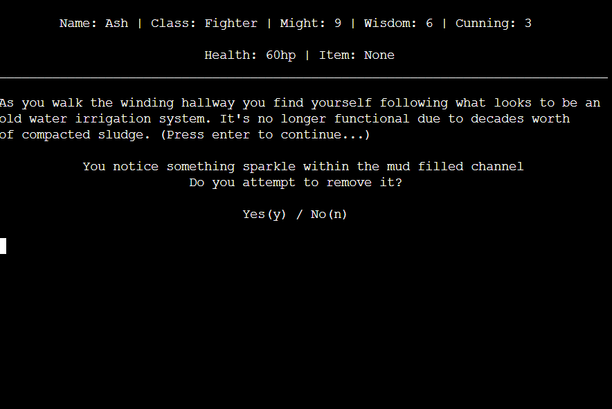

    - ***Chapter 2b***

        - This chapter plays out if the player decides to turn right at the fork in the road. The player has a Thowing Kife thrown at them by an unknown figure, which results in taking 1hp damage. They are then presented with the choice to pick up the Throwing Knife.

    

    - ***Chapter 3a***

        - This chapter plays out if the player decides to go up the stairs at the middle landing. The player encounters a mirror in the middle of a room and is presented with the choice to touch it. If the player chooses to touch it the outcome will differ depending on if they have an item or not. If they don't have an item they will be rewarded with a Mirror Sphere item. If they do have an item they will have their item destroyed an loose 5hp.
        - If they choose to not touch the mirror they will continue to the next between chapter decision. This choice will also cause chapter 5b to play out later in the game.

    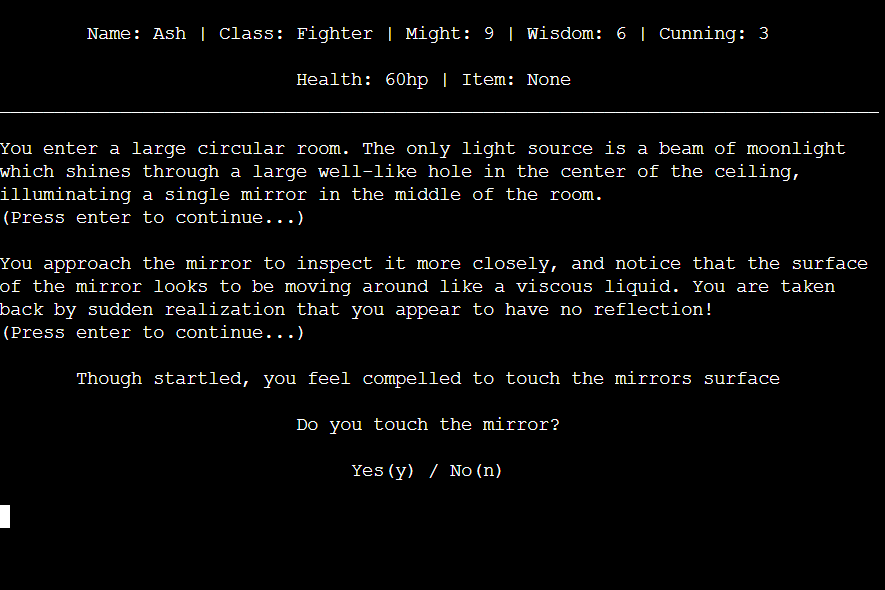

    - ***Chapter 3b***

        - This chapter plays out if the player decides to go down the stairs at the middle landing. The player encounters a spirit who attacks them resulting in combat.

    - ***Chapter 4a***

        - This chapter plays out if the player decides to go through the door at the end of the corridor. The player enters a room where a creature tries to seal the exit with a stone slab.
        - If the players cunning stat is high enough they will escape the room in time, but have to fight the creature.
        - If there cunning stat is too low a spiked ceiling will start to lower above them and they will be presented with another choice: Move the slab, or find another exit.
            - Move the slab: If the players might stat is high enough they successfully move the slab and escape the room.
            - Find another exit: If the players wisdom stat is high enough they successfully find a hidden passageway and escape the room.
            - Faliure on either of these choices will result in a game over, and will return the player to the homescreen.

    

    - ***Chapter 4b***

        - This chapter plays out if the player decides to go through the passageway at the end of the corridor. They enter a narrow passageway where a trap door opens from under them.
        - If the player has a high enough cunning stat, they will land on their feet and not take any damage.
        - If the player's cunning stat is too low they will take 5ph damage.
        - Both outcomes will take the play to the next chapter.

    

    - ***Chapter 5a***

        - This chapter finds the player in a throne room where they are presented with a choice to go into an Armory, Library, or Treasury. The choice will determine which boss the player will face.

    

    - ***Chapter 5b***

        - This chapter will play out before chapter 5a, only if the play decided to not touch the mirror on chapter 3a. The player will encounter the mirror again, and have to fight a clone of themselves. Successfully defeatng the clone will award the Mirror Sphere item to the player.

    

    - ***Boss 1 (Champion's Spirit)***

        - This chapter will play out if the player chooses to enter the Armory in chapter 5a. The player will enter combat with the Champion's Spirit boss. Upon defeating this enemy, they will be congratulated for completing the game, and be redirected to the homescreen.

    

    - ***Boss 2 (Protector of Knowledge)***

        - This chapter will play out if the player chooses to enter the Library in chapter 5a. The player will enter combat with the Protector of Knowledge boss. Upon defeating this enemy, they will be congratulated for completing the game, and be redirected to the homescreen.

    

    - ***Boss 3 (Hoarder Dragon)***

        - This chapter will play out if the player chooses to enter the Treasury in chapter 5a. The player will enter combat with the Hoarder Dragon boss. Upon defeating this enemy, they will be congratulated for completing the game, and be redirected to the homescreen.

    

- **Natures**

    - Every enemy in the game will have a nature (displayed on combat screen). This nature detrmines which of the player's stats is used in the damage calculation when facing the enemy.

 


- **Combat**

    - ***Combat Screen***

        - The combat screen serves as the main means for the player to navigate their options when they encounter an enemy. This screen presents the player with 4 options (light attack, heavy attack, item, and run) shows important information, such as the enemy's name, current health, and nature.

    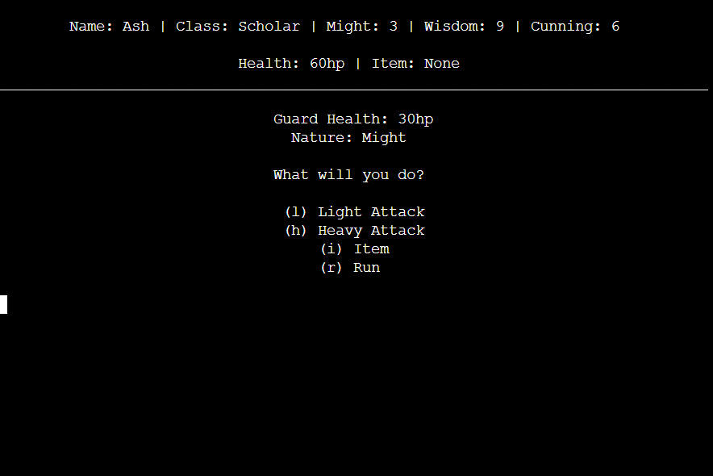

    - ***Attack***

        - The light and heavy attack options will cause both the player and the enemy to attack. The damage dealt & recieved is determined by the enemies nature, and the value of the corrisponding stat used when facing that nature. It is also possible for the player and/or enemy's attack to miss, which for the player is greatly effected by which type of attack they choose. 
        - Light Attack deals lower damage, but has a 90% chance to hit.
        - Heavy Attack deals greater damages but has 50% to hit.

    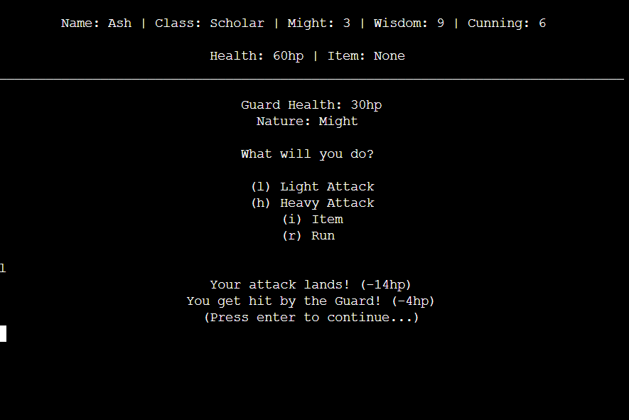

    - ***Accuracy***

        - The player and enemy will both have a chance to miss when either light or heavy attack is selected. A missed attack results in the opposing party taking no damage.
        - Light Attack deals lower damage, but has a 90% chance to hit.
        - Heavy Attack deals greater damages but has 50% to hit.
        - The enemy will always have an 80% chance to land an attack.

    

    - ***Item***

        - The item option will display the name & description of the currently held item. If the item is consumable, it will also prompt the player with the option of using the item.

    

    - ***Run***

        - The run option will have the player attempt to escape combat, which if successful, will progress to the next chapter, or between chapter decision. The player will also miss the possibility of an item-drop. If the run attempt fails, the player will take damage equal to the enemies upper damage output (This is an attribute of the Enemey class, and is not visible to the player). This damage is unaffected by enemy/player nature match-up. There is 30% success chance when attempting to run from combat.

    
    

    - ***Enemy Defeat***

        - Upon reducing an enemy's health to 0, the enemy will be defeated which will progress the player to the next chapter/decision. Many enemies have a chance of dropping an item upon being defeated, for which the player will be prompted to choose if they want to pick the item up or not.

    

- **Player Defeat\Death**

    - Defeat/Death can happen both inside and outside of combat, when the player's health reaches 0. Upon this event the player will be presented with a gameover screen, and be redirected to the homescreen.

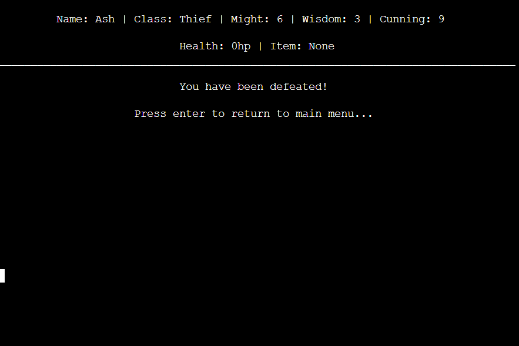


- **Items**

    - ***Item Drops***

        - The combat screen serves as the main means for the player to navigate their options when they encounter an enemy. This screen presents the player with 4 options (light attack, heavy attack, item, and run) shows important information, such as the enemy's name, current health, and nature.

    

    - ***Chainmail***

        - Chainmail is an in-game item which reduces damage taken in combat by 2 while held.

    

    - ***Spiked Gloves***

        - Spiked Gloves are an in-game item which increase the players Might stat by 3 while held.

    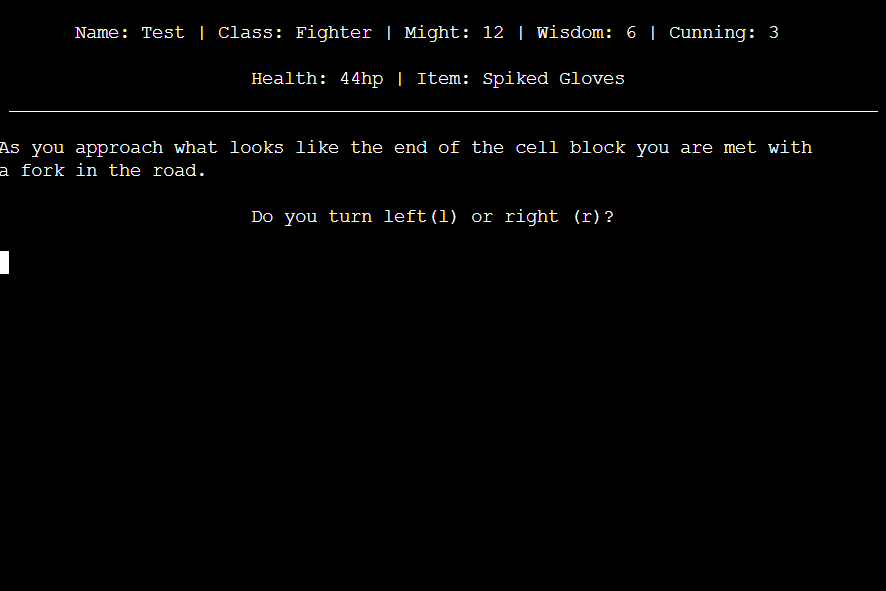

    - ***Hooded Cloak***

        - Hooded Cloak is an in-game item which increase the players Cunning stat by 3 while held.

    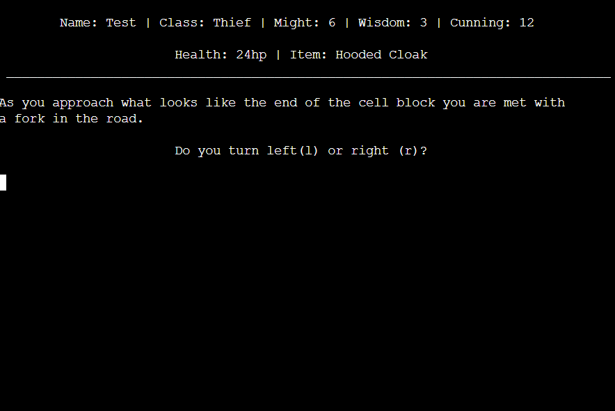

    - ***Lexicon***

        - Lexicon is an in-game item which increase the players Wisdom stat by 3 while held.

    

    - ***Focusing Crystal***

        - Focusing Crystal is an in-game item which increase the player's accuracy by 10% while held. This means that light attacks have 100% chance to land, and heavy attacks have 60% chance to land.

    

    - ***Apple***

        - Apple an in-game item which restores +30hp to the players health when consumed in combat (One time use).

    


    - ***Throwing Knife***

        - Throwing Knife is an in-game item which deals 15hp damage to the current enemy when used in combat (One time use). The player will not receive damage from the enemy when using this item.

    

    - ***Mirror Sphere***

        - Mirror Sphere is an in-game item which has 2 different effects depending if it is used against a normal enemy or a boss (One time use).
        - Normal Enemy - Allows the player guaranteed escape from combat when used.
        - Boss - Gain +60hp & all player stats are doubled until combat is over.

    

    

### Future Features

- More Characters
    - I plan to add more playable characters with different stat distrubution.
- More Enemies
    - I plan to add more enemies to balance the game for each character, and give more content for future chapters.
- More chapters
    - I plan to add additional chapters, with more decisions to further branch the story.
- In game map / coordinate system
    - I plan to overhall the way the decisions navigate which chapter plays out by adding a coordinate system to track player location.
- Enemy Artwork
    - I plan to add ASCII artwork for each enemy that will be displayed during combat.
- Color
    - I plan to add color to some of the ingame elements, such as items & player health.

## Tools & Technologies Used

- [](https://tim.2bn.dev/markdown-builder) used to generate README and TESTING templates.
- [](https://git-scm.com) used for version control. (`git add`, `git commit`, `git push`)
- [](https://github.com) used for secure online code storage.
- [](https://gitpod.io) used as a cloud-based IDE for development.
- [](https://en.wikipedia.org/wiki/HTML) used for the main site content.
- [](https://en.wikipedia.org/wiki/CSS) used for the main site design and layout.
- [](https://www.javascript.com) used to program the terminal to allow python code to be visible on Heroku.
- [](https://www.python.org) used as the back-end programming language.
- [](https://www.heroku.com) used for hosting the deployed back-end site.
- [](https://getbootstrap.com) used as the front-end CSS framework for modern responsiveness and pre-built components.
- [](https://chat.openai.com) used to help debug, troubleshoot, and explain things.
- [](https://chat.openai.com) used to help debug, troubleshoot, and explain things.
- [](https://www.lucidchart.com) used to make flow diagrams for mapping the app's logic
- [](https://www.gimp.org) used to remove background from title image of README.
- [](https://ezgif.com) used to create GIFs for readme file.
- [](https://www.grammarly.com/spell-checker) used to check spelling and grammar of print statements

## Data Model

### Flowchart

To follow best practice, a flowchart was created for the app's logic,
and mapped out before coding began using a free version of
[Lucidchart](https://www.lucidchart.com/pages/ER-diagram-symbols-and-meaning).

Below is the flowchart of the main process of this Python program. It shows the game flow from homescreen to completion.

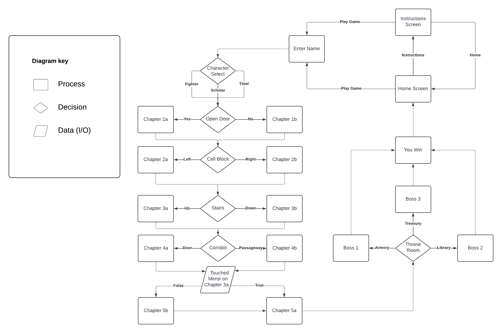

Below is the flowchart of the combat function. It shows the flow of combat based on player decisions, and enemy/player health.

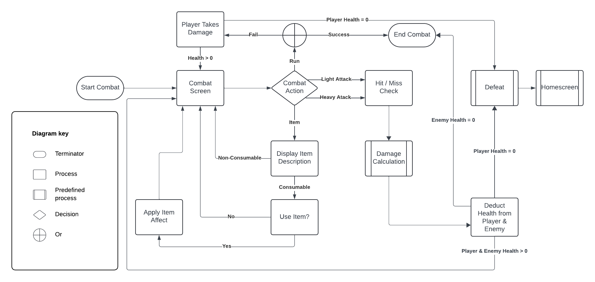


I've also used [Mermaid](https://www.mermaid.live) to generate these flowcharts.

### Game Flow

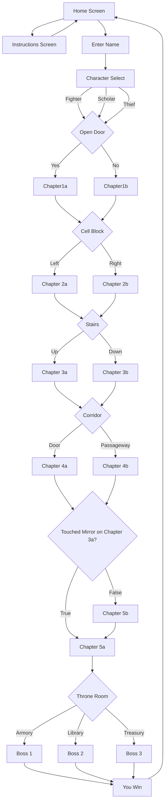

source: [Mermaid](https://mermaid.live/edit#pako:eNp1VF1v2jAU_SuWnwERO0Cbh03rWLVJXTcVpqkLPDiJIVETGzmJGAv89_krOAH6Uh_fe-4555oqDYx5QmEANznfxykRFVjOVwyAr7ygi1hQykIFgcFrMBx-AN9YWYk6rjLOSsvpllqukrmmagWn3vfSzS-souKZFDTUCCioxc4NTfss05JYVhY0p3EVnu_AFPTIBUkNHh-zbSorR9XcSeCR0CLgkXenFnHKcyKnfuwom3MuGgWAQh9P7w0t04xunFHkjCJppKZaNUkHr7RsNzO5LgnPvNePjMSZbpo0zx9yHr81CgENbcC2o6Se6KbqiiH3CMg-Qpf-ot6sx3e7oHaXs5QmLiqSibIxh0lgsNL7teuKYWeOjbljzvme9bjOGF8YY_sCXIgskT9QC-z69mZE9XkW9V0A327fYf8kZUm2dE8OvRkXxL8I4psgS17HKU2-Z0LINPYGzBVwBtzOJmGPr4wfSV7SrufEeU6i9c2Zpaj7I261CenHnNiYqeCMvnBeNAYChU9dYnRBNDLurv_ZP4mCi8MRPPCy9EL1F3jrG7ynLBKkJSJDRLeIS0FJWbdMbJjY7qBddCzdbEvouoR16ZXXvzMWygPI04qY4tUnCQ5gQUVBskR-GRtFXMEqpQVdwUDChIi3FVyxk-SRuuKLA4thIL9zdADrXUIqOs_IVpACBhv1Cw7gjjAYNPAvDLDvje6mMzT18HiGxmN_NoAHGAzxaOoj7Ptocj-b3KF7NDsN4D_5EjDwRmMPI9-XY_KQPa33R_eMqeD1NrVmp_-zqfDx)

### Combat Flow

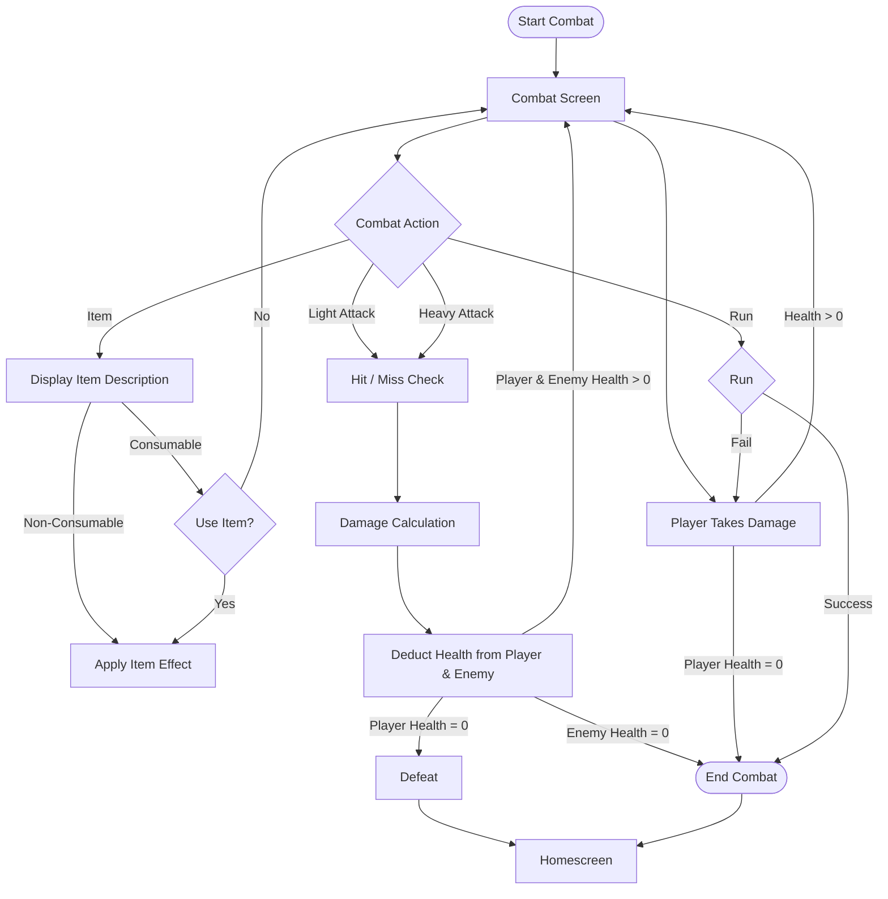

source: [Mermaid](https://mermaid.live/edit#pako:eNp9VF2PmkAU_SuTeWjaRK0iq7sk3WYjNjZpN826fWjBh9nhIkSYITB0a8H_3vlARKV9ce65nHPuncvFClMeAHZwmPBXGpFcoGfXZwithYwXPH0h4q2nATJo8w4Nh_cNWNMcgHkGIIM2PlMGXUJH8UBFzFnVKAw6nPgmofj1l3gbSYYQhO5qtIrF17goFhHQnScBeo8URjqx6TVYAfm17zXodtgRfBaQ1siNiywhewW8JkYKIBcKmseZouuCHaKWLzgrypS8JFCj7wWofCVPLf546FM8cjbsqh6yLNkvwxCo8HRsCptMM9fGWerRDyj0ZDuyC8Yjv3pZxqU7DU1xSUq2sCAJ9UyIVFwm5HTdlmEEEJRUyBknIvIMQAahMOcp-iYvCjl6g5YM0n3TfFekJ3DOOhrco3F90XSP9kzyQUmWLDiurAzbhf1f5a7chRCI8MzRdqyAvvGKp2oD1MKfQj2atu4Fr_c7MIXNNL2mi2eyk-_S5LRjl3Rc5n9O5orcc7e2xd7NfypZjeTPExRlIioZ6X1tM2qX1iWlUJiNO3M7Y30icXJ1TZ_hAU4hT0kcyP-aSql8LCJIwceODAOS73zss4PkkVLw9Z5R7Ii8hAEus4AIcGOyzUmKnZAkhcxmhGGnwr-xM7Uno9vZ3JpNpuO5NR7b8wHeY2c4Hc1sa2rb1s3d_ObWurPmhwH-w7n0mIzGk6ll21ImD_lM-_3Uz0zRnJfbqCl2-AvDcr0h)

### Classes & Functions

The program uses classes as a blueprint for the project's objects (OOP). This allows for the object to be reusable.

```python
class Character:
    """
    Character class
    """
    def __init__(self, name, health, might, wisdom, cunning, item, mirror):
        # properties
        self.name = name
        self.health = health
        self.might = might
        self.wisdom = wisdom
        self.cunning = cunning
        self.item = item
        # Becomes true if player selects (n) on chapter_3a
        self.mirror = mirror

class Enemy:
    """
    Enemy class
    """
    def __init__(self, name, health, nature, min_damage, max_damage, boss):
        # properties
        self.name = name
        self.health = health
        self.nature = nature
        self.min_damage = min_damage
        self.max_damage = max_damage
        self.boss = boss
```

The primary functions used on this application are:

- `select_name()`
    - Prompts user to enter a name, and prevents invalid inputs.
- `select_character()`
    - Displays the playable characters and prompts the user to select one.
- `run_game()`
    - The main function which presents the play with in-game decisions, and calls the corrisponding chapter function.
- `display_instructions_screen()`
    - Displays the instructions screen, and contains the logic to navigate through each page.
- `homescreen()`
    - Displays the homescreen.
- `defeat()`
    - Checks to see if the player or enemy health health is = 0 when in combat, and handles the event accordingly. 
- `item_drop()`
    - Presents player with a choice to pick up an item if enemy drops one on defeat.
- `death_outside_combat()`
    - Shows gameover screen, and redirects plaiyer to homescreen if health reaches 0 outside of combat.
- `combat()`
    -  Displays combat options, and handles logic based on player choices within combat.
- `attack()`
    -  Handles attack logic such as accuracy and damage calculations based on player stats, enemy nature, and player item. Use to create new attacks & control their accuracy & damage output with a single line.
- `light_attack()`
    -  Applies damage and accuracy logic when the player selects light attack option in combat.
- `heavy_attack()`
    -  Applies damage and accuracy logic when the player selects heavy attack option in combat.
- `check_item()`
    -  Displays item description and option to use consumable item when player selects the item option in combat.
- `item_choice()`
    -  Handles logic when player is asked if they want to pick up an item outside of combat.
- `item_buff()`
    -  Applies stat bonuses when player is holding Spiked Gloves, Hooded Clock or Lexicon items.
- `reset_stats()`
    -  Resets the player's Might, Wisdom & Cunning stats to the default base stats for their current character.
- `intro_chapter()`
    -  Handles events and story based on player decisions for the intro chapter.
- `chapter_1a()`
    -  Handles events and story based on player decisions for chapter_1a.
- `chapter_1b()`
    -  Handles events and story based on player decisions for chapter_1b.
- `chapter_2a()`
    -  Handles events and story based on player decisions for chapter_2a.
- `chapter_2b()`
    -  Handles events and story based on player decisions for chapter_2b.
- `chapter_3a()`
    -  Handles events and story based on player decisions for chapter_3a.
- `chapter_3b()`
    -  Handles events and story based on player decisions for chapter_3b.
- `chapter_4a()`
    -  Handles events and story based on player decisions for chapter_4a.
- `chapter_4b()`
    -  Handles events and story based on player decisions for chapter_4b.
- `chapter_5a()`
    -  Handles events and story based on player decisions for chapter_5a.
- `chapter_5b()`
    -  Handles events and story based on player decisions for chapter_5b.
- `boss_a()`
    -  Handles story and commences combat with Champion's Spirit boss.
- `boss_b()`
    -  Handles story and commences combat with Protector of Knowledge boss.
- `boss_c()`
    -  Handles story and commences combat with Hoarder Dragon boss.
- `center_print()`
    -  Prints text in center of terminal.
- `center_input()`
    -  Waits for user input & prints input prompt in center of terminal.
- `clear_terminal()`
    -  Clears all text from the terminal
- `clear_terminal_in_game()`
    -  Clears all text from the terminal, but display top banner with player information.
- `clear_terminal_instructions()`
    -  Clears all text from the terminal, but display top banner with navigation information for instructions page.

### Imports

I've used the following Python packages and/or external imported packages.

- `os`: used for adding a `clear()` function
- `random`: used to get a random choice from a list
- `copy`: used to get create a `deepcopy()` of player character
- `math`: used for `ceil()` function

## Testing

> [!NOTE]  
> For all testing, please refer to the [TESTING.md](TESTING.md) file.

## Deployment

Code Institute has provided a [template](https://github.com/Code-Institute-Org/python-essentials-template) to display the terminal view of this backend application in a modern web browser.
This is to improve the accessibility of the project to others.

The live deployed application can be found deployed on [Heroku](https://dark-castle-lite-2da09c77a17b.herokuapp.com).

### Heroku Deployment

This project uses [Heroku](https://www.heroku.com), a platform as a service (PaaS) that enables developers to build, run, and operate applications entirely in the cloud.

Deployment steps are as follows, after account setup:

- Select **New** in the top-right corner of your Heroku Dashboard, and select **Create new app** from the dropdown menu.
- Your app name must be unique, and then choose a region closest to you (EU or USA), and finally, select **Create App**.
- From the new app **Settings**, click **Reveal Config Vars**, and set the value of KEY to `PORT`, and the value to `8000` then select *add*.
- Further down, to support dependencies, select **Add Buildpack**.
- The order of the buildpacks is important, select `Python` first, then `Node.js` second. (if they are not in this order, you can drag them to rearrange them)

Heroku needs three additional files in order to deploy properly.

- requirements.txt
- Procfile
- runtime.txt

You can install this project's **requirements** (where applicable) using:

- `pip3 install -r requirements.txt`

If you have your own packages that have been installed, then the requirements file needs updated using:

- `pip3 freeze --local > requirements.txt`

The **Procfile** can be created with the following command:

- `echo web: node index.js > Procfile`

The **runtime.txt** file needs to know which Python version you're using:
1. type: `python3 --version` in the terminal.
2. in the **runtime.txt** file, add your Python version:
	- `python-3.9.19`

For Heroku deployment, follow these steps to connect your own GitHub repository to the newly created app:

Either:

- Select **Automatic Deployment** from the Heroku app.

Or:

- In the Terminal/CLI, connect to Heroku using this command: `heroku login -i`
- Set the remote for Heroku: `heroku git:remote -a app_name` (replace *app_name* with your app name)
- After performing the standard Git `add`, `commit`, and `push` to GitHub, you can now type:
	- `git push heroku main`

The frontend terminal should now be connected and deployed to Heroku!

### Local Deployment

This project can be cloned or forked in order to make a local copy on your own system.

For either method, you will need to install any applicable packages found within the *requirements.txt* file.

- `pip3 install -r requirements.txt`.

#### Cloning

You can clone the repository by following these steps:

1. Go to the [GitHub repository](https://github.com/Ash-5p/dark-castle-lite) 
2. Locate the Code button above the list of files and click it 
3. Select if you prefer to clone using HTTPS, SSH, or GitHub CLI and click the copy button to copy the URL to your clipboard
4. Open Git Bash or Terminal
5. Change the current working directory to the one where you want the cloned directory
6. In your IDE Terminal, type the following command to clone my repository:
	- `git clone https://github.com/Ash-5p/dark-castle-lite.git`
7. Press Enter to create your local clone.

Alternatively, if using Gitpod, you can click below to create your own workspace using this repository.

[](https://gitpod.io/#https://github.com/Ash-5p/dark-castle-lite)

Please note that in order to directly open the project in Gitpod, you need to have the browser extension installed.
A tutorial on how to do that can be found [here](https://www.gitpod.io/docs/configure/user-settings/browser-extension).

#### Forking

By forking the GitHub Repository, we make a copy of the original repository on our GitHub account to view and/or make changes without affecting the original owner's repository.
You can fork this repository by using the following steps:

1. Log in to GitHub and locate the [GitHub Repository](https://github.com/Ash-5p/dark-castle-lite)
2. At the top of the Repository (not top of page) just above the "Settings" Button on the menu, locate the "Fork" Button.
3. Once clicked, you should now have a copy of the original repository in your own GitHub account!

### Local VS Deployment

## Credits

### Content

| Source | Location | Notes |
| --- | --- | --- |
| [Markdown Builder](https://tim.2bn.dev/markdown-builder) | README and TESTING | tool to help generate the Markdown files |
| [Chris Beams](https://chris.beams.io/posts/git-commit) | version control | "How to Write a Git Commit Message" |
| [marked-gil](https://github.com/marked-gil/guess-that-word/blob/main/utility_manager.py#L8-L13) | utilities | `clear_terminal()` function |


### Media

| Source | Location | Type | Notes |
| --- | --- | --- | --- |
| [ASCII Art Archive](https://www.asciiart.eu/buildings-and-places/castles) | homescreen | text | ASCII art castle on homescreen |
| [fssymbols](https://fsymbols.com/generators/carty/) | homescreen & instructions screen | text | title text on homescreen & instructions screen |

### Acknowledgements

- I would like to thank my Code Institute mentor, [Tim Nelson](https://github.com/TravelTimN) for his support throughout the development of this project.
- I would like to thank the [Code Institute](https://codeinstitute.net) tutor team for their assistance with troubleshooting and debugging some project issues.
- I would like to thank the [Code Institute Slack community](https://code-institute-room.slack.com) for the moral support; it kept me going during periods of self doubt and impostor syndrome.
- I would like to thank my partner, Lorna, for believing in me, and allowing me to make this transition into software development.
