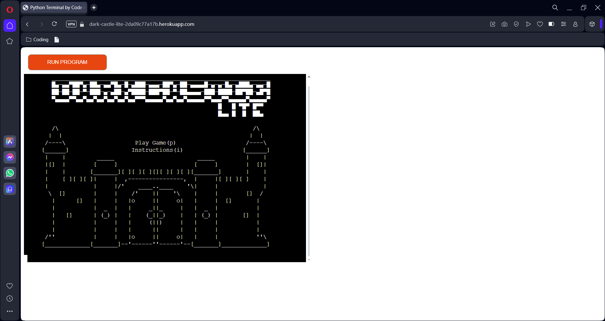
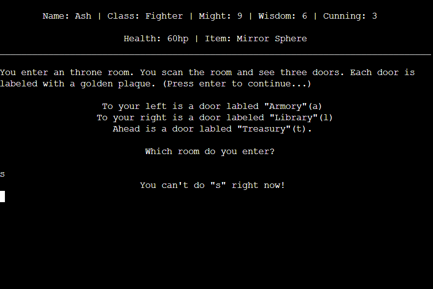

# Testing

> [!NOTE]  
> Return back to the [README.md](README.md) file.

## Code Validation

### Python

I have used the recommended [PEP8 CI Python Linter](https://pep8ci.herokuapp.com) to validate all of my Python files.

| Directory | File | CI URL | Screenshot | Notes |
| --- | --- | --- | --- | --- |
|  | art.py | [PEP8 CI](https://pep8ci.herokuapp.com/https://raw.githubusercontent.com/Ash-5p/dark-castle-lite/main/art.py) |  | |
|  | chapters.py | [PEP8 CI](https://pep8ci.herokuapp.com/https://raw.githubusercontent.com/Ash-5p/dark-castle-lite/main/chapters.py) |  | |
|  | classes.py | [PEP8 CI](https://pep8ci.herokuapp.com/https://raw.githubusercontent.com/Ash-5p/dark-castle-lite/main/classes.py) |  | |
|  | mechanics.py | [PEP8 CI](https://pep8ci.herokuapp.com/https://raw.githubusercontent.com/Ash-5p/dark-castle-lite/main/mechanics.py) |  | |
|  | run.py | [PEP8 CI](https://pep8ci.herokuapp.com/https://raw.githubusercontent.com/Ash-5p/dark-castle-lite/main/run.py) |  | |
|  | utilities.py | [PEP8 CI](https://pep8ci.herokuapp.com/https://raw.githubusercontent.com/Ash-5p/dark-castle-lite/main/utilities.py) |  | |

## Browser Compatibility

I've tested my deployed project on multiple browsers to check for compatibility issues.

| Browser | Home | Notes |
| --- | --- | --- |
| Chrome |  | Works as expected |
| Edge |  | Works as expected |
| Opera |  | Works as expected |

## Responsiveness

I've tested my deployed project on multiple devices to check for responsiveness issues.

| Device | Home | Notes |
| --- | --- | --- |
| Tablet (DevTools) |  | Issues with distorted/blurred text in terminal |
| Desktop |  | Works as expected |
| 4K Monitor |  | Lots of empty white-space due to no-scaling |
| Google Pixel 7 Pro |  | Some `overflow-x` issues due to CI Terminal not being responsive |

## Lighthouse Audit

I've tested my deployed project using the Lighthouse Audit tool to check for any major issues.

| Page | Mobile | Desktop | Notes |
| --- | --- | --- | --- |
| Home |  |  | Some performance warnings for mobile. Minor warnings for accessibility & SEO due to CI Terminal |

## Defensive Programming

Defensive programming was manually tested with the below user acceptance testing:

| Page | Expectation | Test | Result | Fix | Screenshot (Before) | Screenshot (After) | Screenshot (After(alt))
| --- | --- | --- | --- | --- | --- | --- | --- |
| Homescreen | | | | | | | |
| | Homescreen is expected to take the user to choose name screen when "p" is entered | Tested the feature by entering "p" on homescreen | The feature behaved as expected, and it prompted the user to choose a name | Test concluded and passed |  |  |
| | Homescreen is expected to take user to page 1 of the instructions screen when "i" is entered | Tested the feature by entering "i" on homepage | The feature behaved as expected and took the user to page 1 of the instructions screen| Test concluded and passed |  |  |
| | Homescreen is expected to display invalid input message when user enters any value other that "h" or "i" | Tested the feature by entering multiple different values, including letters, numbers, and special characters, on homepage | The feature behaved as expected and displayed invalid input message when user entered anything other than "h" or "i" | Test concluded and passed |  |  |
| Instructions | | | | | | | |
| | Instructions screen is expected to take the user to choose name screen when "p" is entered | Tested the feature by entering "p" on insctructions screen (tested on all 5 pages) | The feature behaved as expected, and it prompted the user to choose a name | Test concluded and passed |  |  |
| | Instructions screen is expected to take the user the homescreen when "h" is entered | Tested the feature by entering "h" on insctructions screen (tested on all 5 pages) | The feature behaved as expected, and took the user to the homescreen | Test concluded and passed |  |  |
| | Instructions screen is expected to take the user to page 1 of instrucitons screen when "1" is entered | Tested the feature by entering "1" on insctructions screen (tested on all 5 pages) | The feature behaved as expected, and took the user to page 1  | Test concluded and passed |  |  |
| | Instructions screen is expected to take the user to page 2 of instrucitons screen when "2" is entered | Tested the feature by entering "2" on insctructions screen (tested on all 5 pages) | The feature behaved as expected, and took the user to page 2 | Test concluded and passed |  |  |
| | Instructions screen is expected to take the user to page 3 of instrucitons screen when "3" is entered | Tested the feature by entering "3" on insctructions screen (tested on all 5 pages) | The feature behaved as expected, and took the user to page 3 | Test concluded and passed |  |  |
| | Instructions screen is expected to take the user to page 4 of instrucitons screen when "4" is entered | Tested the feature by entering "4" on insctructions screen (tested on all 5 pages) | The feature behaved as expected, and took the user to page 4 | Test concluded and passed |  |  |
| | Instructions screen is expected to take the user to page 5 of instrucitons screen when "5" is entered | Tested the feature by entering "5" on insctructions screen (tested on all 5 pages) | The feature behaved as expected, and took the user to page 5 | Test concluded and passed |  |  |
| | Instructions screen is expected to display invalid input message when user enters any value other than "h", "p", "1", "2", "3", "4", or "5" | Tested the feature by entering multiple different values, including letters, numbers, and special characters, on insctructions screen (tested on all 5 pages) | The feature behaved as expected, and displayed invalid input messaged when the user entered any value other than "h", "p", "1", "2", "3", "4", or "5" | Test concluded and passed |  |  |
| Enter Name | | | | | | | |
| | Enter player name screen is expected to take the user to select character screen when a valid name is entered (between 1 & 15 characters, no special characters) | Tested the feature by entering a valid name on enter name screen | The feature behaved as expected, and took user to select character screen | Test concluded and passed |  |  |
| | Enter player name screen is expected to display invalid input message when user enters any value less than 1 character long | Tested the feature by entering an empty string | The feature behaved as expected, and displayed error specific message | Test concluded and passed |  |  |
| | Enter player name screen is expected to display invalid input message when user enters any value with more than 15 characters | Tested the feature by entering a string of more than 15 characters | The feature behaved as expected, and displayed error specific message | Test concluded and passed |  |  |
| | Enter player name screen is expected to display invalid input message when user enters any value containing special characters | Tested the feature by entering a string containing special characters | The feature behaved as expected, and displayed error specific message | Test concluded and passed |  |  |
| Select Character | | | | | | | |
| | Select Character screen is expected to take the user to intro chapter when a valid number is selected entered | Tested the feature by entering a valid number on character select screen | The feature behaved as expected, and took user to intro chapter | Test concluded and passed |  |  |
| | Select Character screen is expected to display invalid input message if user doesn't input a valid number | Tested the feature by entering multiple invalid values on character select screen | The feature behaved as expected, and displayed invalid value message | Test concluded and passed |  |  |
| Intro Chapter | | | | | | | |
| | Intro Chapter is expected to take the user to chapter 1a when "o" is entered| Tested the feature by entering "o" on intro chapter | The feature behaved as expected, and took user to chapter 1a | Test concluded and passed |  |  |
| | Intro Chapter is expected to take the user to chapter 1b when "w" is entered | Tested the feature by entering "w" on intro chapter | The feature behaved as expected, and took user to chapter 1b | Test concluded and passed |  |  |
| | Intro Chapter is expected to display invalid input message when any value other than "w" or  "o" is entered | Tested the feature by entering multiple invalid values on intro chapter | The feature behaved as expected, and displayed error message | Test concluded and passed |  |  |
| Chapter 1a| | | | | | | |
| | Chapter 1a is expected to have the user successfully pick up the chainmail item, or enter combat when the user enters "y" (random outcome based on cunning stat) | Tested the feature by entering a "y" on chapter 1a multiple times to achive both outcomes | The feature behaved as expected, and randomly initiated either outcome | Test concluded and passed |  |  |  |
| | Chapter 1a is expected to have the user leave the chainmail behind if "n" is entered | Tested the feature by entering "n" on chapter 1a | The feature behaved as expected, and resumed the chapter by not picking up the chainmail | Test concluded and passed |  |  |
| | Chapter 1a is expected to display invalid input message when any value other than "y" or  "n" is entered | Tested the feature by entering multiple invalid values on Chapter 1a | The feature behaved as expected, and displayed error message | Test concluded and passed |  |  |
| Run Game Decision 1 | | | | | | | |
| | Decision 1 in the run_game() function is expected to take the player to chapter 2a if they enter "l" | Tested the feature by entering "l" for decision 1 | The feature behaved as expected, and took the user to chapter 2a  | Test concluded and passed |  |  |
| | Decision 1 in the run_game() function is expected to take the player to chapter 2b if they enter "r" | Tested the feature by entering "r" for decision 1 | The feature behaved as expected, and took the user to chapter 2b | Test concluded and passed |  |  |
| | Decision 1 in the run_game() function is expected to display invalid input message when any value other than "l" or  "r" is entered | Tested the feature by entering multiple invalid values on decision 1 | The feature behaved as expected, and displayed error message | Test concluded and passed |  |  |
| Chapter 2a | | | | | | | |
| | Chapter 2a is expected to have the player successfully free the item, or enter combat when the user enters "y" (random outcome based on cunning stat) | Tested the feature by entering a "y" on chapter 2a multiple times to achive both outcomes | The feature behaved as expected, and randomly initiated either outcome | Test concluded and passed |  |  |  |
| | Chapter 2a is expected to have the player ignore the item if "n" is entered | Tested the feature by entering "n" on Chapter 2a | The feature behaved as expected, and resumed the chapter by not picking up the item | Test concluded and passed |  |  |
| | Chapter 2a is expected to display invalid input message when any value other than "y" or  "n" is entered | Tested the feature by entering multiple invalid values on Chapter 2a| The feature behaved as expected, and displayed error message | Test concluded and passed |  |  |
| Run Game Decision 2 | | | | | | | |
| | Decision 2 in the run_game() function is expected to take the player to chapter 3a if they enter "u" | Tested the feature by entering "u" for decision 2 | The feature behaved as expected, and took the user to chapter 3a  | Test concluded and passed |  |  |
| | Decision 2 in the run_game() function is expected to take the player to chapter 3b if they enter "d" | Tested the feature by entering "d" for decision 2 | The feature behaved as expected, and took the user to chapter 3b | Test concluded and passed |  |  |
| | Decision 2 in the run_game() function is expected to display invalid input message when any value other than "u" or  "d" is entered | Tested the feature by entering multiple invalid values on decision 2 | The feature behaved as expected, and displayed error message | Test concluded and passed |  |  |
| Chapter 3a | | | | | | | |
| | Chapter 3a is expected to resume the chapter down two different paths where the user touches the mirror, if they enter "y" (outcome is dependent on wether the player has an item or not) | Tested the feature by entering a "y" on chapter 3a with and without an item to achive both outcomes | The feature behaved as expected, and initiated the corrisponding outcome | Test concluded and passed |  |  |  |
| | Chapter 3a is expected to resume the chapter where the player doesn't touch the mirror if "n" is entered | Tested the feature by entering "n" on Chapter 3a | The feature behaved as expected, and resumed the chapter by touching the mirror | Test concluded and passed |  |  |
| | Chapter 3a is expected to display invalid input message when any value other than "y" or  "n" is entered | Tested the feature by entering multiple invalid values on Chapter 3a| The feature behaved as expected, and displayed error message | Test concluded and passed |  |  |
| Run Game Decision 3 | | | | | | | |
| | Decision 3 in the run_game() function is expected to take the player to chapter 4a if they enter "d" | Tested the feature by entering "d" for decision 3 | The feature behaved as expected, and took the user to chapter 4a  | Test concluded and passed |  |  |
| | Decision 3 in the run_game() function is expected to take the player to chapter 4b if they enter "p" | Tested the feature by entering "p" for decision 3 | The feature behaved as expected, and took the user to chapter 4b | Test concluded and passed |  |  |
| | Decision 3 in the run_game() function is expected to display invalid input message when any value other than "d" or  "p" is entered | Tested the feature by entering multiple invalid values on decision 3 | The feature behaved as expected, and displayed error message | Test concluded and passed |  |  |
| Chapter 4a | | | | | | | |
| | If the player fails the initial Cunning check, Chapter 4a is expected to check the players Might stat and resume the chapter if it is >= 9, or results in game over if not, when the player enters "m" | Tested the feature by entering "m" on chapter 4a with and without Might >= 9 | The feature behaved as expected, and initiated the corrisponding outcome | Test concluded and passed |  |  |  |
| | If the player fails the initial Cunning check, Chapter 4a is expected to check the players Wisdom stat and resume the chapter if it is >= 9, or results in game over if not, when the player enters "w" | Tested the feature by entering "w" on chapter 4a with and without Wisdom >= 9 | The feature behaved as expected, and initiated the corrisponding outcome | Test concluded and passed |  |  |  |
| | Chapter 4a is expected to display invalid input message when any value other than "m" or  "w" is entered | Tested the feature by entering multiple invalid values on Chapter 4a| The feature behaved as expected, and displayed error message | Test concluded and passed |  |  |
| Chapter 5a | | | | | | | |
| | Chapter 5a is expected to take the player to the Champion's Spirit boss if they enter "a" | Tested the feature by entering "a" on chapter 5a | The feature behaved as expected, and took player to Champion's Spirit boss | Test concluded and passed |  |  |
| | Chapter 5a is expected to take the player to the Protector of Knowledge boss if they enter "l" | Tested the feature by entering "l" on chapter 5a | The feature behaved as expected, and took player to Protector of Knowledge boss | Test concluded and passed |  |  |
| | Chapter 5a is expected to take the player to the Hoarder Dragon boss if they enter "t" | Tested the feature by entering "t" on chapter 5a | The feature behaved as expected, and took player to Hoarder Dragon boss | Test concluded and passed |  |  |
| | Chapter 5a is expected to display invalid input message when any value other than "a", "l" or  "t" is entered | Tested the feature by entering multiple invalid values on Chapter 5a| The feature behaved as expected, and displayed error message | Test concluded and passed |  |  |
| Item Choice | | | | | | | |
| | Whenever the player is presented with an item choice, outside of combat, it is expected to replace the player's current item with the new item when the player enters "y" | Tested the feature by entering "y" on each of the item choices outside of combat | The feature behaved as expected, and replaced the player's current item with the new item | Test concluded and passed |  |  |
| | Whenever the player is presented with an item choice, outside of combat, it is expected to ignore the item, and the player's current item will remain the same if the player enters "n" | Tested the feature by entering "n" on each of the item choices outside of combat | The feature behaved as expected, and ignored the item, while keeping the current held item| Test concluded and passed |  |  |
| | Whenever the player is presented with an item choice, outside of combat, it is expected to display invalid input message when any value other than "y" or  "n" is entered | Tested the feature by entering multiple invalid values on each item choice| The feature behaved as expected, and displayed error message | Test concluded and passed |  |  |
| Combat | | | | | | | |
| | During combat, entering "l" is expected to perform a light attack, showing the damage output or "attack missed" message for the enemy & the player (random chance) | Tested the feature by entering "l" multiple times during combat | The feature behaved as expected, displayed damage output or "attack missed" message | Test concluded and passed |  |  |  |
| | During combat, entering "h" is expected to perform a heavy attack, showing the damage output or "attack missed" message for the enemy & the player (random chance) | Tested the feature by entering "h" multiple times during combat | The feature behaved as expected, displayed damage output or "attack missed" message | Test concluded and passed |  |  |  |
| | During combat, entering "i" is expected to display the current held item's description, or display "You don't currently have an item!" message if the player doesn't have an item | Tested the feature by entering "i" with and without an item during combat | The feature behaved as expected, displayed the corrisponding message | Test concluded and passed |  |  |  |
| | During combat, entering "i" while holding a consumable item is expected to display the item description & prompt the player to use the item. Entering "y" is expected to apply the item's effect and remove it from the player's item slot | Tested the feature by entering "y" when prompted to use an item in combat | The feature behaved as expected, and applied the item's effect and removed it from the player's item slot  | Test concluded and passed |  |  |  |
| | During combat, entering "i" while holding a consumable item is expected to display the item description & prompt the player to use the item. Entering "n" is expected to show the message "You put the {item} away" then resume combat | Tested the feature by entering "n" when prompted to use an item in combat | The feature behaved as expected, and displayed the message before resuming combat | Test concluded and passed |  |  |
| | During combat, entering "i" while holding a consumable item is expected to display the item description & prompt the player to use the item. Entering anything other than "y" or "n" is expected to display invalid input message | Tested the feature by entering multiple invalid values | The feature behaved as expected, and displayed error message | Test concluded and passed |  |  |
| | During combat, entering "r" is expected to have either end combat if run attempt was successful, or the player will take damage if unsuccessful (random chance) | Tested the feature by entering "r" multiple times during combat until both outcomes were achived | The feature behaved as expected, and either ended combat, or the player took damage | Test concluded and passed |  |  |  |

## Bugs

- Python player stats not resetting when changing item.

    

    - To fix this, I removed line 96 in run.py "player_character = base_stats", as this was causing base_stats to be overwritten by character_stats, preventing base_stats from storing the player character default stat values.

## Unfixed Bugs

- Application not responsive, due to CI providing the Python terminal for Heroku

    

    - CI provided code for the Python terminal for Heroku

- A user can type CTRL+C in the Heroku app and get an error, they'll need to reload the page to restart the game

    

    - Not able to fix. This is an in-built terminal command designed to disrupt the terminal

> [!NOTE]  
> There are no remaining bugs that I am aware of.
